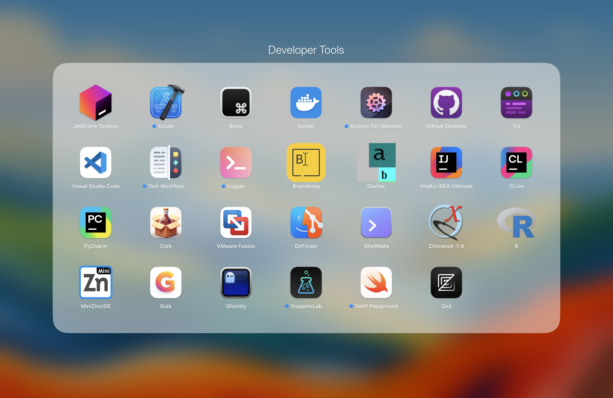
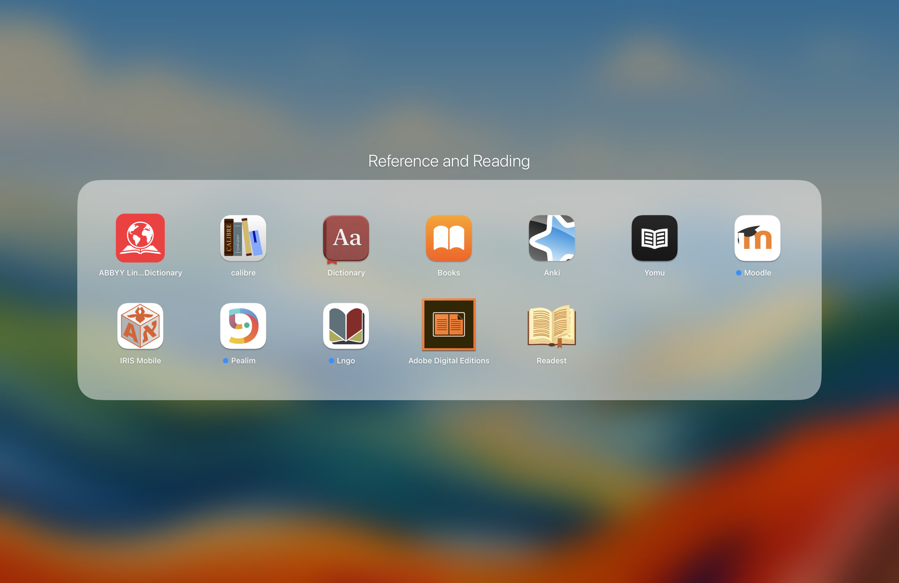
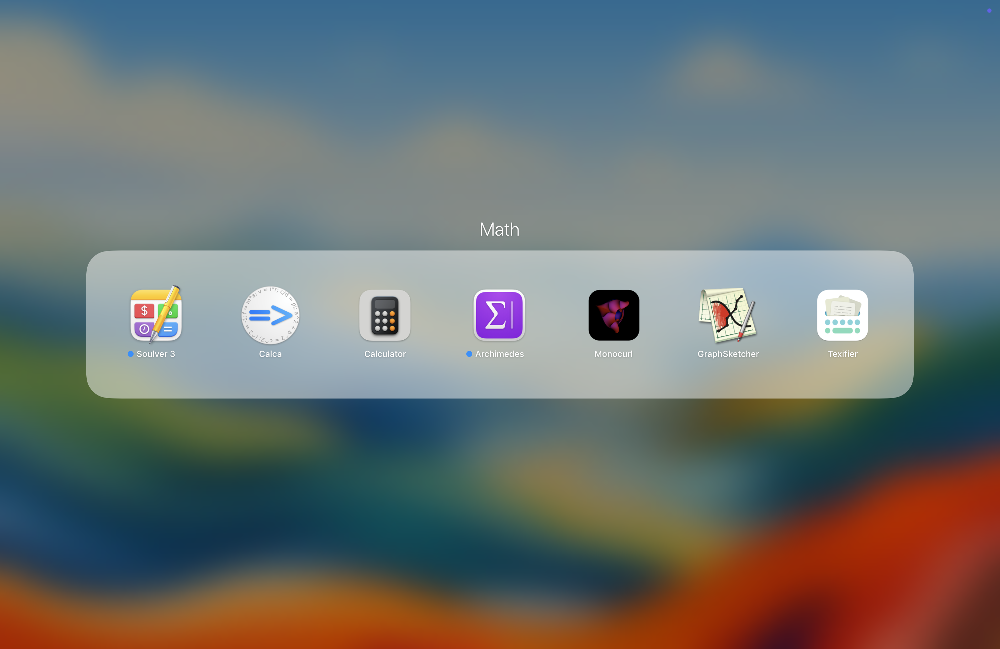
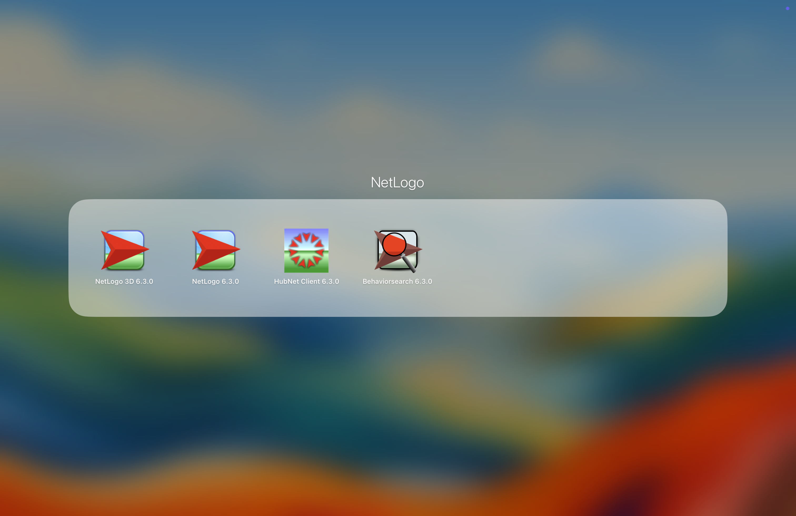

# Sergiy Horef
Hello, and thank you for coming to this github page.
This repo was created for me (mostly) to be able to store information or ideas that would otherwise be hard to backup.
It will have a list of all the apps I use on my devices, and possibly some mechanisms or algorithms that have no immediate place of upload.
If you are reading this, and you are not Sergiy Horef, you could possibly use this repo as a template to become one. (At least in a very shallow non-private sense.)

## Scientific Literature
- GEB (An eternal golden braid.)
- Theory of Self-Reproducing Automata - Von Neumann. (Currenly reading.)

## Fiction Books
(Note that the books are ordered in an ascending order of the date I have finished reading the book. In other words, the last book I have read will also be the last one in the list.)
- Atlas Shrugged.
- Flowers for Algernon.
- The Library of Babel.
- (There is a gap here as there are many books I have read and did not write down anywhere.)
- Blindsight.
- Echopraxia.
- Blood Music.
- Childhoods End.
- Eon by Greg Bear.
- Eternity by Greg Bear.
- Last and First Men.
- More Than Human.
- Ringworld.
- Solaris.
- Stories of Your Life.
- The Aleph.
- The Child Graden.
- The Machine Stops.
- Neuromancer.
- The Metamorphosis of Prime Intellect.
- Diaspora.
- Permutation City.
- Accelerando.
- "Anathem" by Neal Stephenson (currently reading).
- "Ubik" by Philip K. Dick (next).

## Movies
- (2001) A Space Odyssey
- Spider-Man Across the Spider Verse
- Everything Everywhere All at Once
- Dune 1
- Dune 2
### Wishlist
- We live in time

## Social Handles
- Personal Instagram: @sergiyhorefpers
- Threads: @sergiyhorefpers
- Advertisements Instagram: @sergiyhorefad
- Trading Instagram: @sergiyhoreftrade
- Facebook: [Sergiy Horef](https://www.facebook.com/profile.php?id=100007386996172)
- TikTok: @sergiyhoref
- BeReal: @sergiyhoref
- Reddit: [u/Sergiy-Horef](https://www.reddit.com/user/Sergiy-Horef)
- X/Twitter: [@horefsergiy](https://twitter.com/horefsergiy)
- BlueSky: [@sergiyhoref.bsky.social](https://bsky.app/profile/sergiyhoref.bsky.social)
- Telegram: SergiyHoref
- Telegram Private Channel where i post my thought on the world: [link](https://t.me/+x2wCsVk28ONiMjli)
  - Please keep in mind that this is a closed channel, and I will need to approve your request to join. I try to keep a very good hygene of the people I add there, as it directly influences what I do, and don't feel comfortable with posting there.
- Telegram Gallery of Photos: [link](https://t.me/Horef_Gallery)
- Telegram Gallery of Drawings: [link](https://t.me/horef_drawing_gallery)
- Telegram Gallery of Origami: [link](https://t.me/horef_origami)

## Mac apps
### All Apps

### Socials

### Location

### Photography

### Content

### Creator Suite

### Productivity

### Settings

### Other

### Editing

### Information and Social

### Browser

### Office

### Developer Tools

### Utils

### Reference

### Latex

### Math

### DEVONthink

### Video

### Services

### AI tools

### NetLogo

### Writing

